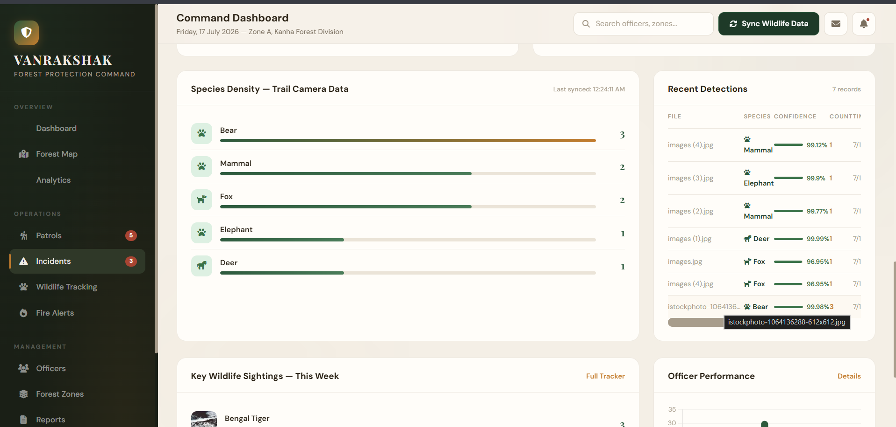
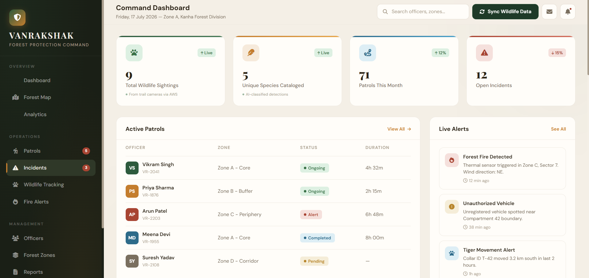

# 🦁 Forest Animal Recognition System (Serverless AWS Edition)

A cloud-native **Forest Animal Recognition System** built using **AWS Lambda**, **Amazon S3**, **Amazon Rekognition**, **Amazon DynamoDB**, and **Python**. The application automatically identifies forest animals from uploaded images using a fully serverless, event-driven architecture.

This project demonstrates how multiple AWS services work together to build a scalable image recognition pipeline without managing traditional servers.

---

# 📸 Project Preview

<p align="center">
  
</p>

<p align="center">
  
</p>

---

# 🚀 Project Overview

The application automatically detects forest animals from uploaded images.

Whenever an image is uploaded to an **Amazon S3 bucket**, AWS Lambda is triggered automatically. The Lambda function sends the image to **Amazon Rekognition**, which analyzes the image and predicts the detected animal. The prediction and processing details are then stored in **Amazon DynamoDB** for future reference.

This project demonstrates a real-world serverless computer vision workflow using AWS managed services.

---

# 🏗️ System Architecture

```text
                 User
                  │
          Upload Animal Image
                  │
                  ▼
            Amazon S3 Bucket
                  │
      Object Created Event
                  │
                  ▼
          AWS Lambda Function
                  │
                  ▼
        Amazon Rekognition
                  │
     Detect Animal Labels
                  │
                  ▼
      Amazon DynamoDB
(Store Prediction Results)
                  │
                  ▼
         CloudWatch Logs
```

---

# ✨ Features

## 🖼️ Image Recognition

- Upload forest animal images
- Automatic image processing
- AI-powered animal detection
- Real-time recognition

---

## ☁️ Serverless Processing

- Automatic Lambda trigger
- Event-driven architecture
- No server management
- Scalable cloud processing

---

## 🧠 Amazon Rekognition

- AI image analysis
- Animal label detection
- Confidence score generation
- Image classification

---

## 🗄️ Data Storage

- Detection results stored in DynamoDB
- Structured prediction records
- Fast NoSQL database access

---

## 🔒 Security

- IAM Role-based permissions
- Secure AWS resource access
- Managed cloud infrastructure

---

# 💻 Technology Stack

## Programming Language

- Python 3

## AWS Services

- Amazon S3
- AWS Lambda
- Amazon Rekognition
- Amazon DynamoDB
- AWS IAM
- Amazon CloudWatch

## Cloud Concepts

- Serverless Computing
- Event-Driven Architecture
- Object Storage
- Image Recognition
- NoSQL Database

---

# 📂 Project Structure

```text
forest-animal-recognition/

│
├── assets/
│   └── dashboard.png
│
├── lambda_function.py
├── README.md
└── screenshots/
```

---

# ⚙️ Application Workflow

```text
Upload Animal Image
          │
          ▼
Amazon S3 Bucket
          │
          ▼
S3 Event Trigger
          │
          ▼
AWS Lambda
          │
          ▼
Amazon Rekognition
          │
          ▼
Detect Animal Labels
          │
          ▼
Store Results
(DynamoDB)
          │
          ▼
CloudWatch Logs
```

---

# ☁️ AWS Services Used

### Amazon S3

- Stores uploaded animal images
- Generates object creation events
- Triggers Lambda automatically

---

### AWS Lambda

- Processes uploaded images
- Integrates AWS services
- Executes serverless business logic

---

### Amazon Rekognition

- Detects animals within uploaded images
- Generates confidence scores
- Performs AI-powered image analysis

---

### Amazon DynamoDB

- Stores prediction results
- Maintains structured detection records
- Provides scalable NoSQL storage

---

### Amazon CloudWatch

- Stores Lambda execution logs
- Monitors application performance
- Assists debugging and monitoring

---

### AWS IAM

- Secure access control
- Role-based permissions
- Service authorization

---

# 🎯 Skills Demonstrated

- AWS Lambda
- Amazon S3
- Amazon Rekognition
- Amazon DynamoDB
- AWS IAM
- Amazon CloudWatch
- Python Programming
- Serverless Computing
- Event-Driven Architecture
- Cloud Computing
- AI Image Recognition
- Git & GitHub

---

# 🚀 Future Enhancements

- Animal species confidence visualization
- Upload multiple images simultaneously
- Web dashboard
- Historical detection records
- Amazon SNS notifications
- Image metadata analysis
- REST API integration
- AWS API Gateway
- Mobile application support
- Real-time analytics dashboard

---

# 📚 Learning Outcomes

This project demonstrates practical experience with:

- Serverless Cloud Architecture
- AWS Lambda Functions
- Amazon Rekognition
- Amazon S3 Event Triggers
- DynamoDB Integration
- CloudWatch Monitoring
- Python Backend Development
- Event-Driven Computing
- AI-based Image Recognition
- Cloud Application Development

---

# 👨‍💻 Author

**Nikhil Fegade**

Computer Engineering Student

**AWS | Python | Serverless | Cloud Computing | Computer Vision | AI Applications**
